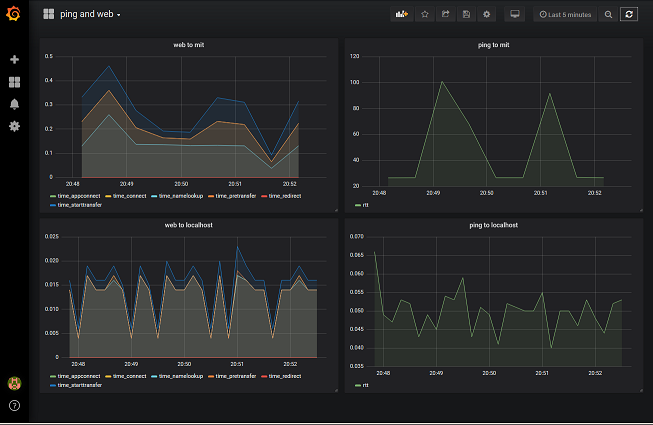

**********
Demo setup
**********

.. index::
   single: demo

.. contents:: Table of Contents

Demo in the Google Cloud
========================

You will need the ``bitd-<version>-<platform>.rpm`` for this demo. On your google cloud account, create a VM instance of*small* type (1 shared VCPU, 1.7GB memory) with a CentOS 7 boot disk. Open an ssh connection *in browser window*.

Install docker
--------------
Install docker with instructions from https://www.digitalocean.com/community/tutorials/how-to-install-and-use-docker-on-centos-7

.. code-block:: none

   sudo yum check-update
   mkdir docker; cd docker
   curl -fsSL https://get.docker.com/ | sh
   sudo systemctl start docker
   sudo systemctl enable docker
   sudo usermod -aG docker $(whoami)

Log out, and log back in for the last command to take effect. Check that docker is running as non-root user:

.. code-block:: none

   docker run hello-world

Install Graphite and Grafana
----------------------------
Execute these docker commands:

.. code-block:: none

   docker run -d \
	--name graphite \
	--restart=always \
	-p 80:80 \
	-p 2003-2004:2003-2004 \
	-p 2023-2024:2023-2024 \
	-p 8125:8125/udp \
	-p 8126:8126 \
	graphiteapp/graphite-statsd
   docker run -d \
        --name grafana \
	--restart=always \
	-p 3000:3000 \
	grafana/grafana

If you open the external IP of the host, you should see your Graphite server. The Grafana server is opened at port 3000, and that has to be `manually opened in the Google Cloud <https://stackoverflow.com/questions/21065922/how-to-open-a-specific-port-such-as-9090-in-google-compute-engine#21068402>`_,

Log into Grafana, and set up Graphite as a data source. The HTTP URL for Graphite should be http://ip-address-of-host, rather than http://localhost (because Grafana is running inside a Docker container, and it needs to reach to the host side IP to access Graphite).

Install the bitdribble rpm
--------------------------
Use scp to transfer ``bitd-<version>-<platform>.rpm`` to the host. You will need to install ``libyaml`` first:

.. code-block:: none

   sudo yum install libyaml
   sudo rpm -ivh bitd-<version>-<platform>.rpm

Edit the config file ``/etc/bitd.yml`` to enable the tasks you are running. Enable and start the service:

.. code-block:: none

   sudo systemctl start bitd
   sudo systemctl enable bitd

Log messages are sent to  ``/var/log/bitd``. You can enable log messages and log levels in ``/etc/bitd.yml``.

.. code-block:: none
   :linenos:

   modules:
     module-name: bitd-config-log
   task-inst:
     task-name: config-log
     task-inst-name: config-log
     schedule:
       type: config
     input:
       log-level: trace
       log-key:
         key-name: bitd-sink-graphite
         log-level: warn

Possible log levels are ``none, crit, error, warn, info, debug, trace``. The ``log-key`` can be used to enable subsystem level logs, assuming you know the key-name of the subsystem. Any change to ``/etc/bitd.yml`` requires a server restart:

.. code-block:: none

   sudo systemctl reload bitd

We now configure two ping tests, with a periodic schedule, using the ``bitd-exec`` module, and a sink task using the ``bitd-sink-graphite`` module. The sink task sends results to a ``graphite`` database back end configued by the ``server`` parameter - in this case, ``localhost:2003`` because the Graphite server is running locally and statsd is listening on TCP port 2003. 

To ensure the ping output (and error) is passed as input to the sink, we configure the tag of ``sink: graphite`` as parameter to both the ``ping`` instances, as well as a parameter to the ``graphite`` sink.

.. code-block:: none
   :linenos:
   :emphasize-lines: 3-4,15-46

   modules:
     module-name: bitd-config-log
     module-name: bitd-exec
     module-name: bitd-sink-graphite
   task-inst:
     task-name: config-log
     task-inst-name: config-log
     schedule:
       type: config
     input:
       log-level: trace
       log-key:
         key-name: bitd-sink-graphite
         log-level: warn
   task-inst:
     task-name: exec
     task-inst-name: ping_to_localhost
     schedule:
       type: periodic
       interval: 10s
     args:
       command: ping -c 1 localhost|grep rtt|awk '{print $4}'| sed s:/:\ :g|awk '{printf "%.3f", $1}'
       command-tmo: 10
     tags:
       sink: graphite
   task-inst:
     task-name: exec
     task-inst-name: ping_to_mit
     schedule:
       type: periodic
       interval: 30s
     args:
       command: ping -c 1 mit.edu|grep rtt|awk '{print $4}'| sed s:/:\ :g|awk '{printf "%.3f", $1}'
       command-tmo: 10
     tags:
       sink: graphite
   task-inst:
     task-name: sink-graphite
     task-inst-name: sink-graphite
     schedule:
       type: triggered-raw
     tags:
       sink: graphite
     args:
       server: localhost:2003
       queue-size: 1000000

Again restart the ``bitd`` service after editing ``/etc/bitd.yml``.

.. code-block:: none

   sudo systemctl reload bitd

The task results can be visualized on the Grafana dashboard at HTTP port 3000. Finally, let's create two additional curl tasks using the ``bitd-exec`` module:

.. code-block:: none
   :linenos:
   :emphasize-lines: 37-58

   modules:
     module-name: bitd-config-log
     module-name: bitd-exec
     module-name: bitd-sink-graphite
   task-inst:
     task-name: config-log
     task-inst-name: config-log
     schedule:
       type: config
     input:
       log-level: trace
       log-key:
         key-name: bitd-sink-graphite
         log-level: warn
   task-inst:
     task-name: exec
     task-inst-name: ping_to_localhost
     schedule:
       type: periodic
       interval: 10s
     args:
       command: ping -c 1 localhost|grep rtt|awk '{print $4}'| sed s:/:\ :g|awk '{printf "%.3f", $1}'
       command-tmo: 10
     tags:
       sink: graphite
   task-inst:
     task-name: exec
     task-inst-name: ping_to_mit
     schedule:
       type: periodic
       interval: 30s
     args:
       command: ping -c 1 mit.edu|grep rtt|awk '{print $4}'| sed s:/:\ :g|awk '{printf "%.3f", $1}'
       command-tmo: 10
     tags:
       sink: graphite
   task-inst:
     task-name: exec
     task-inst-name: web_to_localhost
     schedule:
       type: periodic
       interval: 10s
     args:
       command: 'curl -w "time_total:  %{time_total}\ndetail: \n  time_namelookup:  %{time_namelookup}\n  time_connect:  %{time_connect}\n  time_appconnect:  %{time_appconnect}\n  time_pretransfer:  %{time_pretransfer}\n  time_redirect:  %{time_redirect}\n  time_starttransfer:  %{time_starttransfer}\n" -Ss --output /dev/null http://localhost:3000'
       command-tmo: 10
     tags:
       sink: graphite
   task-inst:
     task-name: exec
     task-inst-name: web_to_mit
     schedule:
       type: periodic
       interval: 30s
     args:
       command: 'curl -w "time_total:  %{time_total}\ndetail: \n  time_namelookup:  %{time_namelookup}\n  time_connect:  %{time_connect}\n  time_appconnect:  %{time_appconnect}\n  time_pretransfer:  %{time_pretransfer}\n  time_redirect:  %{time_redirect}\n  time_starttransfer:  %{time_starttransfer}\n" -Ss --output /dev/null http://mit.edu'
       command-tmo: 10
     tags:
       sink: graphite
   task-inst:
     task-name: sink-graphite
     task-inst-name: sink-graphite
     schedule:
       type: triggered-raw
     tags:
       sink: graphite
     args:
       server: localhost:2003
       queue-size: 1000000

Turn again to the Grafana dashboard at port 3000. This is a sample of how results are displayed (requires dashboard configuration):

